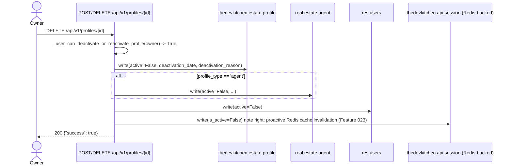
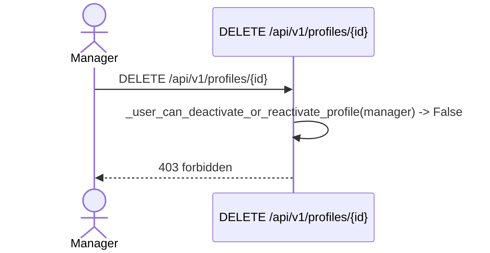
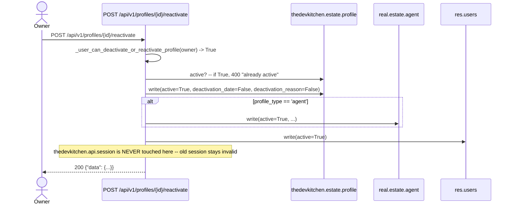
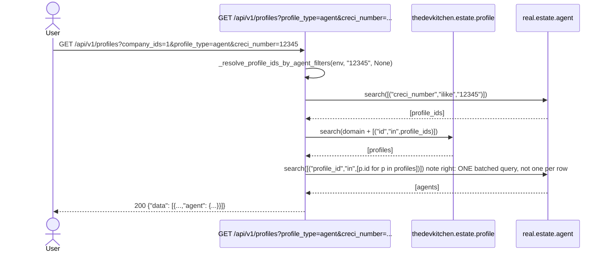
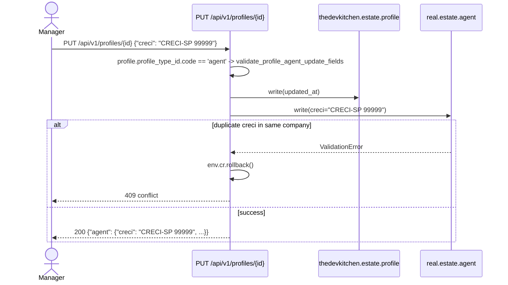

# Feature 027 — Journey Flowcharts

## User Story 1: Owner deactivates a profile (any profile_type)

## User Story 1b: Manager attempts to deactivate (denied)

## User Story 2: Owner reactivates a previously deactivated profile

## User Story 3: Any authorized user lists agents via /profiles

## User Story 4: Manager updates an agent's CRECI via /profiles

