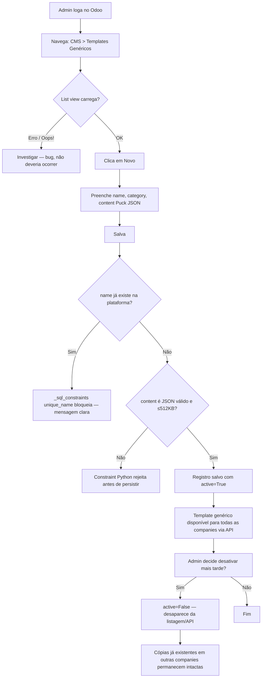
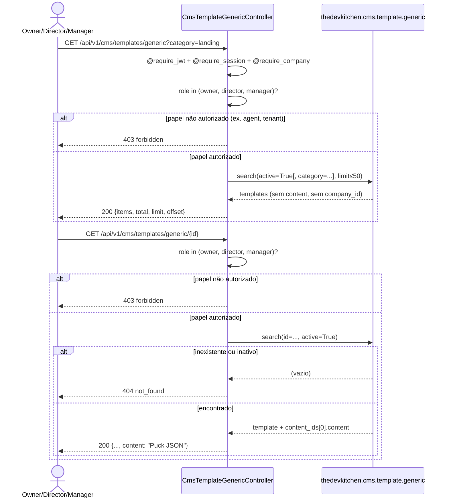
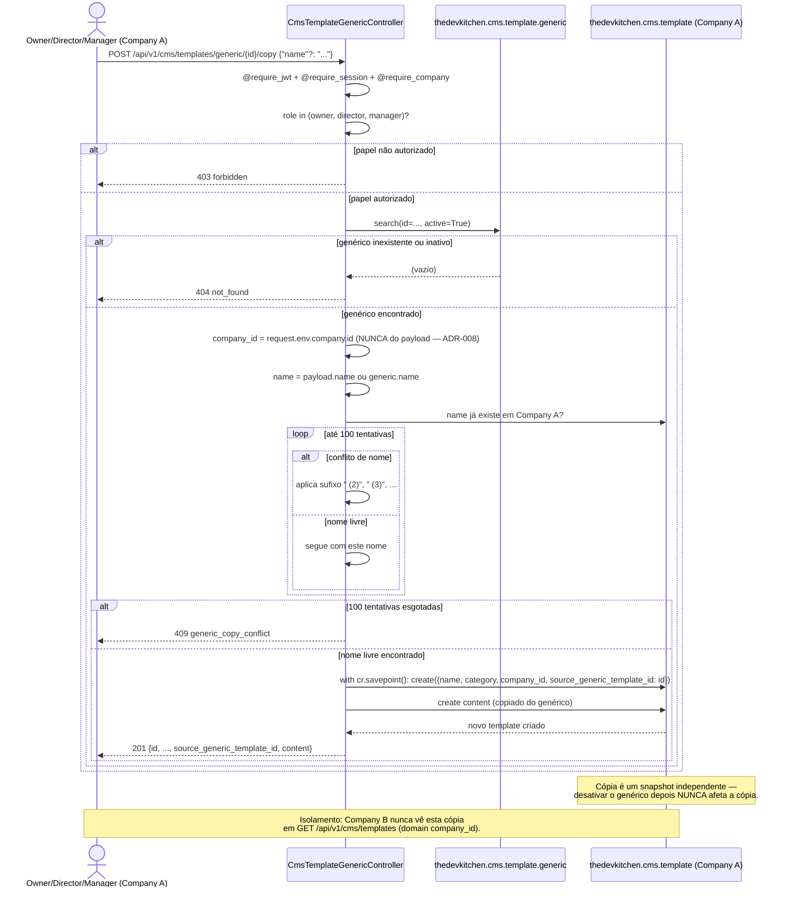

# Feature 028 — Journey Flowcharts

One diagram per user story, covering actor, actions, endpoints (method + path), and decision points, per the spec's Success Criteria.

---

## User Story 1: Admin gerencia o catálogo de templates genéricos via Odoo UI

Fluxo 100% Odoo UI (admin-only, sem endpoint REST de escrita — ADR-029).

---

## User Story 2: Owner/Director/Manager lista e visualiza templates genéricos

---

## User Story 3: Owner/Director/Manager copia um template genérico para a própria company

