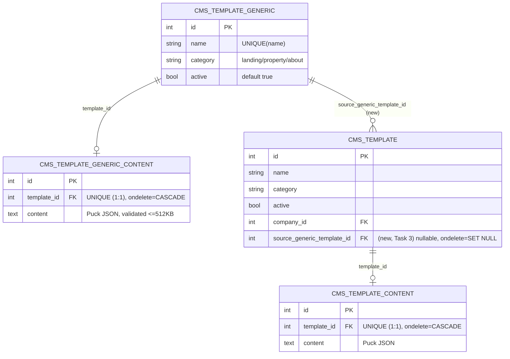

# CMS Generic Templates (Platform Catalog) Implementation Plan

> **For agentic workers:** REQUIRED SUB-SKILL: Use superpowers:subagent-driven-development (recommended) or superpowers:executing-plans to implement this plan task-by-task. Steps use checkbox (`- [ ]`) syntax for tracking.

**Goal:** Add a platform-level, non-tenant catalog of CMS templates (`thedevkitchen.cms.template.generic`) that the Odoo system admin curates via the Odoo UI, and that `owner`/`director`/`manager` users of any company can list, view, and copy into their own company-scoped `thedevkitchen.cms.template` catalog via 3 new REST endpoints.

**Architecture:** Extends the existing `thedevkitchen_cms` module (Feature 021). Two new models (`thedevkitchen.cms.template.generic` + `.content`, 1:1, no `company_id`) are managed exclusively through Odoo backend views (admin-only, per ADR-029 — no REST write path exists for them). A new controller (`cms_template_generic_controller.py`) exposes 3 read/copy-only REST endpoints, reusing the exact `("owner", "director", "manager")` role tuple already enforced in `cms_template_controller.py`. The copy action creates a real `thedevkitchen.cms.template` row scoped to the caller's company, with a new `source_generic_template_id` traceability field — a one-time snapshot, never synced back.

**Tech Stack:** Odoo 18.0 ORM (`odoo.models`/`odoo.fields`/`odoo.api`), Odoo `http.Controller` REST endpoints, `thedevkitchen_apigateway` auth decorators (`@require_jwt`/`@require_session`/`@require_company`), plain `unittest`+`unittest.mock` for unit tests (no DB), bash/curl for E2E API tests, Cypress for E2E UI tests.

## Global Constraints

- **Spec:** `specs/028-cms-generic-templates/spec-idea.md` — every FR/NFR below traces back to it.
- **ADR-004:** new model/table names use the `thedevkitchen.` / `thedevkitchen_` prefix — `thedevkitchen.cms.template.generic` → table `thedevkitchen_cms_template_generic`; `thedevkitchen.cms.template.generic.content` → table `thedevkitchen_cms_template_generic_content`.
- **ADR-008 (non-negotiable):** the copy endpoint NEVER reads `company_id` from the request payload — it is always `request.env.company.id`.
- **ADR-011:** all 3 new REST endpoints use `@require_jwt` + `@require_session` + `@require_company`, applied in that exact order (matches every existing route in `cms_template_controller.py`).
- **ADR-015:** soft delete only — the generic template model uses `active=False`; no `unlink()` path is exposed anywhere.
- **ADR-019 / ADR-029 (non-negotiable):** authorization for all 3 endpoints is the literal tuple `("owner", "director", "manager")` — reused as-is (imported/copied verbatim), never redigitized. No endpoint in this feature ever accepts `base.group_system` — there is intentionally **no** REST create/update/delete route for the generic template; it is managed exclusively via the Odoo backend UI.
- **Content limit:** `content` (Puck JSON) must be valid JSON and ≤ 512 KB (`MAX_GENERIC_CONTENT_BYTES = 512 * 1024`), same ceiling as `thedevkitchen.cms.page.content`.
- **Pagination:** listing defaults to `limit=50`, hard-capped at `50`.
- **Menus:** the new menu item carries **no** `groups` attribute (matches how `menu_cms_templates` already works — only the shared `menu_cms_root` parent carries `groups`).
- **Docker/test environment:** compose file `18.0/docker-compose.yml`, service `odoo`, db `realestate`, addons mounted at `/mnt/extra-addons` inside the container. Task 1 adds `thedevkitchen_cms/tests/run_unit_tests.py` (it did not exist before this plan) plus a new `tests/integration/` directory (TransactionCase, real DB — mirrors the split already used by `quicksol_estate`). From Task 1 Step 6 onward, run unit tests with:
  `docker compose -f 18.0/docker-compose.yml exec -T odoo python3 /mnt/extra-addons/thedevkitchen_cms/tests/run_unit_tests.py`
  and integration tests with:
  `docker compose -f 18.0/docker-compose.yml exec -T odoo odoo -d realestate -u thedevkitchen_cms --test-enable --stop-after-init --log-level=test --http-port=8988`
- **Never delete/reset test/fixture data** as part of verification — accumulated seed/fixture data is a durable asset for this project, not noise to clean up.
- **Full verification command** (run only at the end, Task 11): `bash scripts/validate_coverage.sh` (ADR-003 flow: unit → E2E API → optional Cypress). For the E2E API phase during iteration, run only the new script directly — `integration_tests/test_us028_cms_generic_templates.sh` — never the whole `integration_tests/` suite blindly (Odoo's per-IP login cooldown will block a large sequential batch).

---

## Database Schema Diagram

Two new tables (Tasks 1–2) plus one new column on an existing table (Task 3):



`CMS_TEMPLATE_GENERIC` has no `company_id` (platform-level, visible to all companies — Task 1/4). `CMS_TEMPLATE` and `CMS_TEMPLATE_CONTENT` are shown at their full current shape (not just the new column) so the diagram is self-contained; only `source_generic_template_id` and its new relationship edge are new.

---

### Task 1: Model — `thedevkitchen.cms.template.generic`

This task also introduces `tests/integration/` (TransactionCase, real DB) to `thedevkitchen_cms` for the first time — this module previously only had `tests/unit/` (plain `unittest`, no DB), which cannot truly exercise ORM-level guarantees (`required=True`, `Selection`, `_sql_constraints`). The project's `quicksol_estate` module already has this split; Task 1 replicates it here. Two empirically-verified facts drive the test assertions below (checked live against this exact Odoo/Postgres version via `odoo shell` before writing this plan): a missing `required=True` field raises `psycopg2.errors.NotNullViolation` (an `IntegrityError` subtype), not `odoo.exceptions.ValidationError`; an invalid `Selection` value raises a plain `ValueError`, entirely in Python, before any SQL runs.

**Files:**
- Create: `18.0/extra-addons/thedevkitchen_cms/models/cms_template_generic.py`
- Modify: `18.0/extra-addons/thedevkitchen_cms/models/__init__.py`
- Create: `18.0/extra-addons/thedevkitchen_cms/tests/integration/test_cms_template_generic_crud.py`
- Create: `18.0/extra-addons/thedevkitchen_cms/tests/integration/__init__.py`
- Modify: `18.0/extra-addons/thedevkitchen_cms/tests/__init__.py` (currently empty)
- Create: `18.0/extra-addons/thedevkitchen_cms/tests/run_unit_tests.py` (needed so `scripts/validate_coverage.sh` auto-detects and runs the new `tests/integration/` directory — see Step 6)

**Interfaces:**
- Produces: model `thedevkitchen.cms.template.generic` with fields `name` (Char, required), `category` (Selection: landing/property/about, required, indexed), `active` (Boolean, default True). **`content_ids` is intentionally NOT added in this task** — a `One2many` to a comodel that doesn't exist anywhere yet (`thedevkitchen.cms.template.generic.content`, created in Task 2) makes Odoo's registry fail to load entirely (`KeyError` in `fields.py:setup_nonrelated`, confirmed live), not just a test failure. Task 2 adds `content_ids` back onto this file once its comodel exists.
- Consumes: nothing (new leaf model).

- [ ] **Step 1: Write the failing test**

Create `18.0/extra-addons/thedevkitchen_cms/tests/integration/test_cms_template_generic_crud.py`:

```python
# -*- coding: utf-8 -*-
"""
Integration tests for thedevkitchen.cms.template.generic — exercises the
real Odoo ORM (required=True, Selection values, _sql_constraints, soft
delete) against a live transactional database. Feature 028.

Exception types below were verified empirically against this project's
Odoo/Postgres version via `odoo shell` before writing this test: a missing
required field raises psycopg2.errors.NotNullViolation (an IntegrityError
subtype), not odoo.exceptions.ValidationError; an invalid Selection value
raises a plain ValueError before any SQL executes.
"""
from psycopg2 import IntegrityError

from odoo.tests.common import TransactionCase


class TestCmsTemplateGenericCrud(TransactionCase):

    def setUp(self):
        super().setUp()
        self.Generic = self.env["thedevkitchen.cms.template.generic"].sudo()
        # Defensive cleanup: TransactionCase rolls back between test methods,
        # but not necessarily between separate `odoo --test-enable`
        # invocations against the same dev database (same precaution as
        # quicksol_estate/tests/integration/test_validation_gaps.py).
        self.Generic.search([("name", "like", "it_generic_")]).unlink()

    def test_create_with_valid_data(self):
        tpl = self.Generic.create({"name": "it_generic_landing", "category": "landing"})
        self.assertTrue(tpl.id)
        self.assertTrue(tpl.active)
        self.assertEqual(tpl.category, "landing")

    def test_name_required(self):
        with self.assertRaises(IntegrityError):
            with self.env.cr.savepoint():
                self.Generic.create({"category": "landing"})

    def test_category_required(self):
        with self.assertRaises(IntegrityError):
            with self.env.cr.savepoint():
                self.Generic.create({"name": "it_generic_no_category"})

    def test_category_rejects_unknown_value(self):
        with self.assertRaises(ValueError):
            self.Generic.create({"name": "it_generic_bad_category", "category": "not-a-real-category"})

    def test_unique_name_conflict(self):
        self.Generic.create({"name": "it_generic_dup", "category": "landing"})
        with self.assertRaises(IntegrityError):
            with self.env.cr.savepoint():
                self.Generic.create({"name": "it_generic_dup", "category": "property"})

    def test_soft_delete_keeps_record(self):
        tpl = self.Generic.create({"name": "it_generic_soft_delete", "category": "about"})
        tpl.write({"active": False})
        self.assertFalse(tpl.active)
        found = self.Generic.with_context(active_test=False).search([("id", "=", tpl.id)])
        self.assertEqual(len(found), 1, "Deactivating must not remove the row")
```

Create `18.0/extra-addons/thedevkitchen_cms/tests/integration/__init__.py`:

```python
# -*- coding: utf-8 -*-
"""
Integration Tests for thedevkitchen_cms Module

TransactionCase-based tests requiring a live Odoo/database connection.
Execution: docker compose -f 18.0/docker-compose.yml exec odoo \
    odoo -d realestate -u thedevkitchen_cms \
    --test-enable --stop-after-init --log-level=test --http-port=8988
"""
from . import test_cms_template_generic_crud
```

Modify `18.0/extra-addons/thedevkitchen_cms/tests/__init__.py` (currently empty — both imports below are required; importing only the `integration` package is not enough for Odoo's test loader to discover the module, per the same gap `quicksol_estate` hit and documented in its own `tests/__init__.py`):

```python
# -*- coding: utf-8 -*-
# NOTE: Do NOT import tests/unit/* here - they run independently via
# tests/run_unit_tests.py (plain unittest, no Odoo/DB).

# Integration tests directory (TransactionCase - WITH database)
from . import integration

# Feature 028: thedevkitchen.cms.template.generic ORM-level validations
from .integration import test_cms_template_generic_crud
```

- [ ] **Step 2: Run test to verify it fails**

Run: `docker compose -f 18.0/docker-compose.yml exec -T odoo odoo -d realestate -u thedevkitchen_cms --test-enable --stop-after-init --log-level=test --http-port=8988`
Expected: non-zero exit / traceback — `KeyError: 'thedevkitchen.cms.template.generic'` (model not registered yet) when the test tries `self.env["thedevkitchen.cms.template.generic"]`.

- [ ] **Step 3: Create the model**

Create `18.0/extra-addons/thedevkitchen_cms/models/cms_template_generic.py`:

```python
# -*- coding: utf-8 -*-
from odoo import models, fields


class CmsTemplateGeneric(models.Model):
    _name = "thedevkitchen.cms.template.generic"
    _description = "CMS Generic Template (Platform Catalog)"
    _order = "name"

    # ==================== CORE FIELDS ====================

    name = fields.Char(string="Template Name", required=True)
    category = fields.Selection(
        selection=[
            ("landing", "Landing Page"),
            ("property", "Property Page"),
            ("about", "About Page"),
        ],
        string="Category",
        required=True,
        index=True,
    )
    active = fields.Boolean(default=True)

    # ==================== BACK-REFERENCES ====================
    # content_ids (One2many to thedevkitchen.cms.template.generic.content)
    # is added in Task 2, once that comodel exists — adding it here first
    # makes Odoo's registry fail to load entirely (KeyError in
    # fields.py:setup_nonrelated, confirmed live), since the comodel isn't
    # defined anywhere yet.

    # ==================== SQL CONSTRAINTS ====================

    _sql_constraints = [
        (
            "unique_name",
            "UNIQUE(name)",
            "A generic template with this name already exists.",
        ),
    ]
```

Note: no custom `@api.constrains` for `category` — a Odoo `Selection` field already rejects any value outside its declared options at the ORM level, and this model has no REST write path (FR1.1) through which an out-of-band value could ever arrive, so a redundant constraint would guard against a scenario that cannot happen.

- [ ] **Step 4: Wire the model into the module**

Modify `18.0/extra-addons/thedevkitchen_cms/models/__init__.py`:

```python
# -*- coding: utf-8 -*-
from . import cms_page
from . import cms_page_content
from . import cms_template
from . import cms_template_content
from . import cms_template_generic
from . import cms_media
from . import cms_settings
```

- [ ] **Step 5: Run test to verify it passes**

Run: `docker compose -f 18.0/docker-compose.yml exec -T odoo odoo -d realestate -u thedevkitchen_cms --test-enable --stop-after-init --log-level=test --http-port=8988`
Expected: exit code `0`, log shows `test_cms_template_generic_crud` running its 6 tests with `0 failed, 0 error`.

- [ ] **Step 6: Add the module's own unit-test runner (so `scripts/validate_coverage.sh` auto-detects and runs `tests/integration/`)**

Create `18.0/extra-addons/thedevkitchen_cms/tests/run_unit_tests.py`:

```python
#!/usr/bin/env python3
# -*- coding: utf-8 -*-
"""
Unit test runner for thedevkitchen_cms.

Runs every plain unittest.TestCase file under tests/unit/ (no Odoo
environment, no database). TransactionCase-based tests live in
tests/integration/ instead and are run separately, via
`odoo -u thedevkitchen_cms --test-enable` — scripts/validate_coverage.sh
auto-detects and runs tests/integration/ once this file exists (see its
"runner exists" branch, which additionally checks for a tests/integration
directory), which is why this file needs to exist even though tests/unit/
alone previously worked fine with the generic fallback runner.

Usage: python3 run_unit_tests.py
"""
import sys
import unittest
from pathlib import Path

import odoo.addons

_ADDONS_ROOT = str(Path(__file__).resolve().parents[2])  # /mnt/extra-addons
if _ADDONS_ROOT not in odoo.addons.__path__:
    odoo.addons.__path__.insert(0, _ADDONS_ROOT)

_MODULE_DIR = Path(__file__).resolve().parent.parent  # .../thedevkitchen_cms
_UNIT_DIR = _MODULE_DIR / "tests" / "unit"


def main():
    loader = unittest.TestLoader()
    suite = loader.discover(str(_UNIT_DIR), pattern="test_*.py", top_level_dir=str(_MODULE_DIR))
    result = unittest.TextTestRunner(verbosity=2).run(suite)
    sys.exit(0 if result.wasSuccessful() else 1)


if __name__ == "__main__":
    main()
```

Run: `docker compose -f 18.0/docker-compose.yml exec -T odoo python3 /mnt/extra-addons/thedevkitchen_cms/tests/run_unit_tests.py`
Expected: `OK` — this discovers and runs the same pre-existing `tests/unit/test_cms_*.py` files the generic runner already ran in this project's baseline (82 tests before Task 1), confirming the new local runner is a drop-in replacement, not a behavior change.

- [ ] **Step 7: Restart Odoo and confirm the module upgrades cleanly**

Run: `docker compose -f 18.0/docker-compose.yml exec -T odoo odoo -d realestate -u thedevkitchen_cms --stop-after-init --log-level=warn`
Expected: exit code `0`, no traceback in output. This creates the `thedevkitchen_cms_template_generic` table.

- [ ] **Step 8: Commit**

```bash
git add 18.0/extra-addons/thedevkitchen_cms/models/cms_template_generic.py \
        18.0/extra-addons/thedevkitchen_cms/models/__init__.py \
        18.0/extra-addons/thedevkitchen_cms/tests/integration/test_cms_template_generic_crud.py \
        18.0/extra-addons/thedevkitchen_cms/tests/integration/__init__.py \
        18.0/extra-addons/thedevkitchen_cms/tests/__init__.py \
        18.0/extra-addons/thedevkitchen_cms/tests/run_unit_tests.py
git commit -m "feat(028): add thedevkitchen.cms.template.generic model with tests/integration/ coverage"
```

---

### Task 2: Model — `thedevkitchen.cms.template.generic.content` + content validation

**Files:**
- Create: `18.0/extra-addons/thedevkitchen_cms/models/cms_template_generic_content.py`
- Modify: `18.0/extra-addons/thedevkitchen_cms/models/cms_template_generic.py` (Task 1 deliberately left this model without `content_ids` — a `One2many` to a comodel that didn't exist yet made the Odoo registry fail to load entirely; add it back now that the comodel exists)
- Modify: `18.0/extra-addons/thedevkitchen_cms/models/__init__.py`
- Test: `18.0/extra-addons/thedevkitchen_cms/tests/unit/test_cms_template_generic_content_validations.py`

**Interfaces:**
- Consumes: `thedevkitchen.cms.template.generic` (Task 1) via `template_id` Many2one.
- Produces: model `thedevkitchen.cms.template.generic.content` (`template_id`, `content`); module-level pure function `validate_generic_content(content: str | None) -> None` (raises `odoo.exceptions.ValidationError`) and constant `MAX_GENERIC_CONTENT_BYTES = 512 * 1024`, both importable from `odoo.addons.thedevkitchen_cms.models.cms_template_generic_content` — later tasks (Task 6's controller) do not need this function directly (Odoo UI is the only write path), but the constant name is referenced here for consistency with `cms_page_service.MAX_CONTENT_BYTES`. Also produces the completed `content_ids` One2many on `thedevkitchen.cms.template.generic` (Task 1's model), consumed by Task 7's form view and Task 5's `_serialize_generic_template`.

- [ ] **Step 1: Write the failing test**

Create `18.0/extra-addons/thedevkitchen_cms/tests/unit/test_cms_template_generic_content_validations.py`:

```python
# -*- coding: utf-8 -*-
"""
Unit tests for validate_generic_content() — the pure-function JSON/size
validator backing thedevkitchen.cms.template.generic.content's
@api.constrains('content'). Extracted as a standalone function (same
rationale as CmsPageService._update_content) so it can be unit-tested
without an Odoo environment.
"""
import json
import unittest

from odoo.addons.thedevkitchen_cms.models.cms_template_generic_content import (
    MAX_GENERIC_CONTENT_BYTES,
    validate_generic_content,
)

try:
    from odoo.exceptions import ValidationError
except (ImportError, ModuleNotFoundError, AttributeError):
    class ValidationError(Exception):  # noqa: N818
        pass


class TestValidateGenericContent(unittest.TestCase):

    def test_none_is_allowed(self):
        validate_generic_content(None)  # must not raise

    def test_empty_string_is_allowed(self):
        validate_generic_content("")  # must not raise

    def test_valid_json_is_allowed(self):
        content = json.dumps({"root": {}, "content": []})
        validate_generic_content(content)  # must not raise

    def test_invalid_json_raises(self):
        with self.assertRaises(ValidationError):
            validate_generic_content("not-a-json-string")

    def test_content_within_limit_is_allowed(self):
        payload = json.dumps({"content": ["x" * 100]})
        self.assertLessEqual(len(payload.encode("utf-8")), MAX_GENERIC_CONTENT_BYTES)
        validate_generic_content(payload)  # must not raise

    def test_content_over_limit_raises(self):
        oversized = json.dumps({"content": "x" * (MAX_GENERIC_CONTENT_BYTES + 1)})
        with self.assertRaises(ValidationError):
            validate_generic_content(oversized)

    def test_limit_is_512kb(self):
        self.assertEqual(MAX_GENERIC_CONTENT_BYTES, 512 * 1024)


if __name__ == "__main__":
    unittest.main()
```

- [ ] **Step 2: Run test to verify it fails**

Run: `docker compose -f 18.0/docker-compose.yml exec -T odoo python3 /mnt/extra-addons/thedevkitchen_cms/tests/run_unit_tests.py`
Expected: FAIL/ERROR — `ModuleNotFoundError: No module named 'odoo.addons.thedevkitchen_cms.models.cms_template_generic_content'`.

- [ ] **Step 3: Create the model + validator**

Create `18.0/extra-addons/thedevkitchen_cms/models/cms_template_generic_content.py`:

```python
# -*- coding: utf-8 -*-
import json
from odoo import models, fields, api
from odoo.exceptions import ValidationError

MAX_GENERIC_CONTENT_BYTES = 512 * 1024  # 512 KB — same limit as thedevkitchen.cms.page.content


def validate_generic_content(content):
    """Raise ValidationError if content is set but is not valid JSON, or
    exceeds MAX_GENERIC_CONTENT_BYTES. Pure function (no Odoo env required)
    so it is directly unit-testable — see
    tests/unit/test_cms_template_generic_content_validations.py."""
    if not content:
        return
    if len(content.encode("utf-8")) > MAX_GENERIC_CONTENT_BYTES:
        raise ValidationError("Generic template content exceeds the 512KB limit.")
    try:
        json.loads(content)
    except (ValueError, TypeError):
        raise ValidationError("Generic template content must be valid JSON.")


class CmsTemplateGenericContent(models.Model):
    _name = "thedevkitchen.cms.template.generic.content"
    _description = "CMS Generic Template Content"

    # ==================== CORE FIELDS ====================

    template_id = fields.Many2one(
        comodel_name="thedevkitchen.cms.template.generic",
        string="Generic Template",
        required=True,
        ondelete="cascade",
        index=True,
    )
    content = fields.Text(
        string="Content (Puck JSON)",
        help="Puck editor JSON payload for this generic template. Validated for JSON validity and size (≤512KB).",
    )

    # ==================== SQL CONSTRAINTS ====================

    _sql_constraints = [
        (
            "unique_template",
            "UNIQUE(template_id)",
            "A generic template can have only one content record (1:1 relationship).",
        ),
    ]

    # ==================== VALIDATION ====================

    @api.constrains("content")
    def _check_content(self):
        for record in self:
            validate_generic_content(record.content)
```

- [ ] **Step 4: Add `content_ids` back onto `cms_template_generic.py`**

Task 1 deliberately shipped `thedevkitchen.cms.template.generic` without a `content_ids` field, because a `One2many` pointing at a comodel that doesn't exist anywhere yet makes the entire Odoo registry fail to load (`KeyError` in `fields.py:setup_nonrelated`) — not a test failure, a fatal crash. Now that `thedevkitchen.cms.template.generic.content` exists (Step 3), add the field back.

Modify `18.0/extra-addons/thedevkitchen_cms/models/cms_template_generic.py` — replace the placeholder comment block:

```python
    # ==================== BACK-REFERENCES ====================
    # content_ids (One2many to thedevkitchen.cms.template.generic.content)
    # is added in Task 2, once that comodel exists — adding it here first
    # makes Odoo's registry fail to load entirely (KeyError in
    # fields.py:setup_nonrelated, confirmed live), since the comodel isn't
    # defined anywhere yet.
```

with:

```python
    # ==================== BACK-REFERENCES ====================

    content_ids = fields.One2many(
        comodel_name="thedevkitchen.cms.template.generic.content",
        inverse_name="template_id",
        string="Template Content",
    )
```

- [ ] **Step 5: Wire the model into the module**

Modify `18.0/extra-addons/thedevkitchen_cms/models/__init__.py`:

```python
# -*- coding: utf-8 -*-
from . import cms_page
from . import cms_page_content
from . import cms_template
from . import cms_template_content
from . import cms_template_generic
from . import cms_template_generic_content
from . import cms_media
from . import cms_settings
```

- [ ] **Step 6: Run test to verify it passes**

Run: `docker compose -f 18.0/docker-compose.yml exec -T odoo python3 /mnt/extra-addons/thedevkitchen_cms/tests/run_unit_tests.py`
Expected: `OK` — all tests pass, including `TestValidateGenericContent`.

- [ ] **Step 7: Upgrade the module**

Run: `docker compose -f 18.0/docker-compose.yml exec -T odoo odoo -d realestate -u thedevkitchen_cms --stop-after-init --log-level=warn`
Expected: exit code `0`, no traceback (this confirms `content_ids` now resolves correctly — the registry-load crash from Task 1's Step 5/7 must NOT reoccur). Creates table `thedevkitchen_cms_template_generic_content`.

- [ ] **Step 8: Re-run Task 1's integration tests to confirm no regression**

Run: `docker compose -f 18.0/docker-compose.yml exec -T odoo odoo -d realestate -u thedevkitchen_cms --test-enable --stop-after-init --log-level=test --http-port=8988`
Expected: exit code `0`, `test_cms_template_generic_crud`'s 6 tests still pass — adding `content_ids` must not change any of Task 1's behavior.

- [ ] **Step 9: Commit**

```bash
git add 18.0/extra-addons/thedevkitchen_cms/models/cms_template_generic_content.py \
        18.0/extra-addons/thedevkitchen_cms/models/cms_template_generic.py \
        18.0/extra-addons/thedevkitchen_cms/models/__init__.py \
        18.0/extra-addons/thedevkitchen_cms/tests/unit/test_cms_template_generic_content_validations.py
git commit -m "feat(028): add thedevkitchen.cms.template.generic.content model with JSON/size validation"
```

---

### Task 3: Extend `thedevkitchen.cms.template` with `source_generic_template_id`

**Files:**
- Modify: `18.0/extra-addons/thedevkitchen_cms/models/cms_template.py`

**Interfaces:**
- Consumes: `thedevkitchen.cms.template.generic` (Task 1).
- Produces: new field `thedevkitchen.cms.template.source_generic_template_id` (Many2one, optional, `ondelete="set null"`, `readonly=True`) — consumed by Task 6's copy endpoint.

- [ ] **Step 1: Add the field**

Modify `18.0/extra-addons/thedevkitchen_cms/models/cms_template.py` — current content is:

```python
# -*- coding: utf-8 -*-
from odoo import models, fields


class CmsTemplate(models.Model):
    _name = "thedevkitchen.cms.template"
    _description = "CMS Template"
    _order = "name"

    # ==================== CORE FIELDS ====================

    name = fields.Char(string="Template Name", required=True)
    category = fields.Selection(
        selection=[
            ("landing", "Landing Page"),
            ("property", "Property Page"),
            ("about", "About Page"),
        ],
        string="Category",
        required=True,
    )
    active = fields.Boolean(default=True)
    company_id = fields.Many2one(
        comodel_name="res.company",
        string="Company",
        required=True,
        default=lambda self: self.env.company,
    )

    # ==================== BACK-REFERENCES ====================

    content_ids = fields.One2many(
        comodel_name="thedevkitchen.cms.template.content",
        inverse_name="template_id",
        string="Template Content",
    )
    html_content = fields.Html(
        string="HTML Content",
        sanitize=False,
        help="Rich text content for editing in the Odoo admin UI. The API uses the Puck JSON (content_ids).",
    )

    # ==================== SQL CONSTRAINTS ====================

    _sql_constraints = [
        (
            "unique_name_company",
            "UNIQUE(name, company_id)",
            "A template with this name already exists for this company.",
        ),
    ]
```

Replace the "BACK-REFERENCES" block to add the new field:

```python
    # ==================== BACK-REFERENCES ====================

    content_ids = fields.One2many(
        comodel_name="thedevkitchen.cms.template.content",
        inverse_name="template_id",
        string="Template Content",
    )
    html_content = fields.Html(
        string="HTML Content",
        sanitize=False,
        help="Rich text content for editing in the Odoo admin UI. The API uses the Puck JSON (content_ids).",
    )
    source_generic_template_id = fields.Many2one(
        comodel_name="thedevkitchen.cms.template.generic",
        string="Source Generic Template",
        ondelete="set null",
        readonly=True,
        help="Generic (platform-level) template this record was copied from, if any. "
        "Null when created manually. Deactivating/deleting the source never affects this copy.",
    )
```

(The `SQL CONSTRAINTS` block below is unchanged.)

- [ ] **Step 2: Upgrade the module and confirm the migration is clean**

Run: `docker compose -f 18.0/docker-compose.yml exec -T odoo odoo -d realestate -u thedevkitchen_cms --stop-after-init --log-level=warn`
Expected: exit code `0`, no traceback. Adds column `source_generic_template_id` to `thedevkitchen_cms_template`.

- [ ] **Step 3: Run the full unit suite to confirm no regression**

Run: `docker compose -f 18.0/docker-compose.yml exec -T odoo python3 /mnt/extra-addons/thedevkitchen_cms/tests/run_unit_tests.py`
Expected: `OK` — this field has no custom validation, so no new test is added here (a bare `Many2one` is already covered by Odoo's FK integrity; adding a test would duplicate framework guarantees).

- [ ] **Step 4: Commit**

```bash
git add 18.0/extra-addons/thedevkitchen_cms/models/cms_template.py
git commit -m "feat(028): add source_generic_template_id traceability field to cms.template"
```

---

### Task 4: Security — `ir.model.access.csv`

**Files:**
- Modify: `18.0/extra-addons/thedevkitchen_cms/security/ir.model.access.csv`

**Interfaces:**
- Consumes: models from Task 1 and Task 2 (`model_thedevkitchen_cms_template_generic`, `model_thedevkitchen_cms_template_generic_content` — Odoo auto-generates these `ir.model` xml ids from the model's technical name).
- Produces: access rows so `base.group_system` has full CRUD (needed for the Odoo backend form in Task 7) and `quicksol_estate.group_real_estate_user` has read-only access (FR1.2 — "for internal consistency"; the REST endpoints in Task 5/6 use `.sudo()` so they do not depend on this row for authorization, which is instead enforced by the explicit role check).

- [ ] **Step 1: Add the access rows**

Modify `18.0/extra-addons/thedevkitchen_cms/security/ir.model.access.csv` — append these 4 lines at the end of the file (after the existing `access_cms_settings_admin` line):

```csv
access_cms_template_generic_admin,Admin: CMS Generic Template,model_thedevkitchen_cms_template_generic,base.group_system,1,1,1,1
access_cms_template_generic_user,User: CMS Generic Template (read-only),model_thedevkitchen_cms_template_generic,quicksol_estate.group_real_estate_user,1,0,0,0
access_cms_template_generic_content_admin,Admin: CMS Generic Template Content,model_thedevkitchen_cms_template_generic_content,base.group_system,1,1,1,1
access_cms_template_generic_content_user,User: CMS Generic Template Content (read-only),model_thedevkitchen_cms_template_generic_content,quicksol_estate.group_real_estate_user,1,0,0,0
```

- [ ] **Step 2: Upgrade the module to load the new access rows**

Run: `docker compose -f 18.0/docker-compose.yml exec -T odoo odoo -d realestate -u thedevkitchen_cms --stop-after-init --log-level=warn`
Expected: exit code `0`, no traceback (no "referenced model does not exist" errors — this confirms the `model_thedevkitchen_cms_template_generic*` xml ids from Tasks 1–2 resolved correctly).

- [ ] **Step 3: Commit**

```bash
git add 18.0/extra-addons/thedevkitchen_cms/security/ir.model.access.csv
git commit -m "feat(028): grant admin CRUD and internal read access to generic template models"
```

---

### Task 5: Controller — list + detail endpoints

**Files:**
- Create: `18.0/extra-addons/thedevkitchen_cms/controllers/cms_template_generic_controller.py`
- Modify: `18.0/extra-addons/thedevkitchen_cms/controllers/__init__.py`
- Test: `18.0/extra-addons/thedevkitchen_cms/tests/unit/test_cms_template_generic_controller.py`

**Interfaces:**
- Consumes: `thedevkitchen.cms.template.generic` (Task 1); `resolve_role` from `odoo.addons.quicksol_estate.services.role_resolver`; `require_jwt`/`require_session`/`require_company` from `odoo.addons.thedevkitchen_apigateway.middleware`; `_cms_error` from `..services.cms_error_helpers`.
- Produces: module-level constant `GENERIC_TEMPLATE_MANAGEMENT_ROLES = ("owner", "director", "manager")` and function `_serialize_generic_template(template, include_content=False) -> dict`, both importable from `odoo.addons.thedevkitchen_cms.controllers.cms_template_generic_controller` — Task 6 (same file) reuses both.
- Routes: `GET /api/v1/cms/templates/generic`, `GET /api/v1/cms/templates/generic/<int:template_id>`.

- [ ] **Step 1: Write the failing test**

Create `18.0/extra-addons/thedevkitchen_cms/tests/unit/test_cms_template_generic_controller.py`:

```python
# -*- coding: utf-8 -*-
"""
Unit tests for the pure helpers backing cms_template_generic_controller.py.
The HTTP route methods themselves (list_generic_templates, get_generic_template,
copy_generic_template) require a live Odoo request/env and are exercised by
integration_tests/test_us028_cms_generic_templates.sh instead — consistent
with how cms_template_controller.py's routes have never carried their own
unit tests in this module.
"""
import unittest
from unittest.mock import MagicMock

from odoo.addons.thedevkitchen_cms.controllers.cms_template_generic_controller import (
    GENERIC_TEMPLATE_MANAGEMENT_ROLES,
    _serialize_generic_template,
)


class TestGenericTemplateManagementRoles(unittest.TestCase):

    def test_roles_match_cms_template_controller_exactly(self):
        """Must be the literal same tuple as cms_template_controller.py's
        role check, to avoid authorization drift between sibling controllers
        (spec Non-Goal: 'não redigitar a lista')."""
        self.assertEqual(GENERIC_TEMPLATE_MANAGEMENT_ROLES, ("owner", "director", "manager"))

    def test_agent_role_not_authorized(self):
        self.assertNotIn("agent", GENERIC_TEMPLATE_MANAGEMENT_ROLES)

    def test_tenant_role_not_authorized(self):
        self.assertNotIn("tenant", GENERIC_TEMPLATE_MANAGEMENT_ROLES)


class TestSerializeGenericTemplate(unittest.TestCase):

    def _make_template(self, content=None):
        tpl = MagicMock()
        tpl.id = 1
        tpl.name = "seed_generic_landing"
        tpl.category = "landing"
        tpl.active = True
        tpl.create_date.isoformat.return_value = "2026-09-01T10:00:00"
        tpl.write_date.isoformat.return_value = "2026-09-01T10:00:00"
        if content is not None:
            content_record = MagicMock()
            content_record.content = content
            tpl.content_ids = [content_record]
        else:
            tpl.content_ids = []
        return tpl

    def test_list_serialization_excludes_content(self):
        """Listing must never include 'content' — avoids N+1 and heavy payloads."""
        tpl = self._make_template(content='{"content": []}')
        data = _serialize_generic_template(tpl, include_content=False)
        self.assertNotIn("content", data)

    def test_list_serialization_excludes_company_id(self):
        """Generic templates have no company_id — must never appear in the payload."""
        tpl = self._make_template()
        data = _serialize_generic_template(tpl, include_content=False)
        self.assertNotIn("company_id", data)

    def test_detail_serialization_includes_content(self):
        tpl = self._make_template(content='{"content": []}')
        data = _serialize_generic_template(tpl, include_content=True)
        self.assertEqual(data["content"], '{"content": []}')

    def test_detail_serialization_content_none_when_no_content_record(self):
        tpl = self._make_template(content=None)
        data = _serialize_generic_template(tpl, include_content=True)
        self.assertIsNone(data["content"])

    def test_serialization_includes_core_fields(self):
        tpl = self._make_template()
        data = _serialize_generic_template(tpl)
        self.assertEqual(data["id"], 1)
        self.assertEqual(data["name"], "seed_generic_landing")
        self.assertEqual(data["category"], "landing")
        self.assertTrue(data["active"])


if __name__ == "__main__":
    unittest.main()
```

- [ ] **Step 2: Run test to verify it fails**

Run: `docker compose -f 18.0/docker-compose.yml exec -T odoo python3 /mnt/extra-addons/thedevkitchen_cms/tests/run_unit_tests.py`
Expected: FAIL/ERROR — `ModuleNotFoundError: No module named 'odoo.addons.thedevkitchen_cms.controllers.cms_template_generic_controller'`.

- [ ] **Step 3: Create the controller (list + detail only for now)**

Create `18.0/extra-addons/thedevkitchen_cms/controllers/cms_template_generic_controller.py`:

```python
# -*- coding: utf-8 -*-
import json
import logging
from odoo import http
from odoo.http import request, Response
from odoo.exceptions import ValidationError, UserError
from odoo.addons.quicksol_estate.services.role_resolver import resolve_role
from odoo.addons.thedevkitchen_apigateway.middleware import (
    require_jwt,
    require_session,
    require_company,
)
from ..services.cms_error_helpers import _cms_error

_logger = logging.getLogger(__name__)

_GENERIC_TEMPLATE_LIST_LIMIT = 50

# Same literal tuple as cms_template_controller.py — reused, never redigitized,
# to avoid authorization drift between sibling controllers (ADR-019).
GENERIC_TEMPLATE_MANAGEMENT_ROLES = ("owner", "director", "manager")


def _serialize_generic_template(template, include_content=False):
    data = {
        "id": template.id,
        "name": template.name,
        "category": template.category,
        "active": template.active,
        "created_at": template.create_date.isoformat() if template.create_date else None,
        "updated_at": template.write_date.isoformat() if template.write_date else None,
    }
    if include_content:
        data["content"] = template.content_ids[0].content if template.content_ids else None
    return data


class CmsTemplateGenericController(http.Controller):

    # ==================== LIST ====================

    @http.route(
        "/api/v1/cms/templates/generic",
        type="http",
        auth="none",
        methods=["GET"],
        csrf=False,
        cors="*",
    )
    @require_jwt
    @require_session
    @require_company
    def list_generic_templates(self, **kwargs):
        role = resolve_role(request.env.user) or ""
        if role not in GENERIC_TEMPLATE_MANAGEMENT_ROLES:
            return _cms_error(403, "forbidden", "Insufficient permissions")

        try:
            offset = int(request.httprequest.args.get("offset", 0))
            limit = min(
                int(request.httprequest.args.get("limit", _GENERIC_TEMPLATE_LIST_LIMIT)),
                _GENERIC_TEMPLATE_LIST_LIMIT,
            )
        except (ValueError, TypeError):
            return _cms_error(400, "validation_error", "Invalid pagination parameters")

        domain = [("active", "=", True)]
        category = request.httprequest.args.get("category")
        if category:
            domain.append(("category", "=", category))

        Generic = request.env["thedevkitchen.cms.template.generic"].sudo()
        templates = Generic.search(domain, limit=limit, offset=offset, order="name")
        total = Generic.search_count(domain)
        payload = {
            "items": [_serialize_generic_template(t) for t in templates],
            "total": total,
            "offset": offset,
            "limit": limit,
        }
        return Response(json.dumps(payload), status=200, content_type="application/json")

    # ==================== GET BY ID ====================

    @http.route(
        "/api/v1/cms/templates/generic/<int:template_id>",
        type="http",
        auth="none",
        methods=["GET"],
        csrf=False,
        cors="*",
    )
    @require_jwt
    @require_session
    @require_company
    def get_generic_template(self, template_id, **kwargs):
        role = resolve_role(request.env.user) or ""
        if role not in GENERIC_TEMPLATE_MANAGEMENT_ROLES:
            return _cms_error(403, "forbidden", "Insufficient permissions")

        template = request.env["thedevkitchen.cms.template.generic"].sudo().search(
            [("id", "=", template_id), ("active", "=", True)], limit=1
        )
        if not template:
            return _cms_error(404, "not_found", f"Generic template {template_id} not found")

        return Response(
            json.dumps(_serialize_generic_template(template, include_content=True)),
            status=200,
            content_type="application/json",
        )
```

- [ ] **Step 4: Wire the controller into the module**

Modify `18.0/extra-addons/thedevkitchen_cms/controllers/__init__.py`:

```python
# -*- coding: utf-8 -*-
from . import cms_page_controller
from . import cms_media_controller
from . import cms_public_controller
from . import cms_template_controller
from . import cms_template_generic_controller
from . import cms_settings_controller
```

- [ ] **Step 5: Run test to verify it passes**

Run: `docker compose -f 18.0/docker-compose.yml exec -T odoo python3 /mnt/extra-addons/thedevkitchen_cms/tests/run_unit_tests.py`
Expected: `OK` — all tests pass, including `TestGenericTemplateManagementRoles` and `TestSerializeGenericTemplate`.

- [ ] **Step 6: Restart the odoo service and manually smoke-test the routes**

Run: `docker compose -f 18.0/docker-compose.yml restart odoo`

Then (after the login step defined in Task 10, or reusing an existing valid `session_id`/company id pair) confirm the route is registered:
Run: `docker compose -f 18.0/docker-compose.yml exec -T odoo odoo shell -d realestate --no-http <<< "print(env['ir.http']._match('/api/v1/cms/templates/generic'))"`
Expected: no `NotFound` exception printed (full curl-based verification happens in Task 10).

- [ ] **Step 7: Commit**

```bash
git add 18.0/extra-addons/thedevkitchen_cms/controllers/cms_template_generic_controller.py \
        18.0/extra-addons/thedevkitchen_cms/controllers/__init__.py \
        18.0/extra-addons/thedevkitchen_cms/tests/unit/test_cms_template_generic_controller.py
git commit -m "feat(028): add GET list/detail endpoints for generic templates"
```

---

### Task 6: Controller — copy endpoint

**Files:**
- Modify: `18.0/extra-addons/thedevkitchen_cms/controllers/cms_template_generic_controller.py`
- Modify: `18.0/extra-addons/thedevkitchen_cms/tests/unit/test_cms_template_generic_controller.py`

**Interfaces:**
- Consumes: `GENERIC_TEMPLATE_MANAGEMENT_ROLES`, `_serialize_generic_template` (Task 5, same file); `thedevkitchen.cms.template` + its new `source_generic_template_id` field (Task 3); `thedevkitchen.cms.template.content`.
- Produces: pure functions `_unique_company_template_name(env, base_name, company_id) -> str | None` and `_build_copy_create_vals(generic, name, company_id) -> dict`, both unit-tested directly; route `POST /api/v1/cms/templates/generic/<int:template_id>/copy`.

- [ ] **Step 1: Write the failing test — append to the existing test file**

Append to `18.0/extra-addons/thedevkitchen_cms/tests/unit/test_cms_template_generic_controller.py` (add the import at the top alongside the existing ones, and the new test classes at the bottom, before the `if __name__ == "__main__":` line):

Add to the top imports:

```python
from odoo.addons.thedevkitchen_cms.controllers.cms_template_generic_controller import (
    GENERIC_TEMPLATE_MANAGEMENT_ROLES,
    _serialize_generic_template,
    _build_copy_create_vals,
    _unique_company_template_name,
)
```

Add before `if __name__ == "__main__":`:

```python
class TestBuildCopyCreateVals(unittest.TestCase):

    def _make_generic(self, id_=1, category="landing"):
        generic = MagicMock()
        generic.id = id_
        generic.category = category
        return generic

    def test_vals_use_explicit_company_id_not_payload(self):
        """ADR-008: company_id always comes from the session-derived argument,
        never from request payload — this function's signature doesn't even
        accept a raw payload dict, only the already-resolved company_id int."""
        generic = self._make_generic()
        vals = _build_copy_create_vals(generic, "Landing Padrão", company_id=42)
        self.assertEqual(vals["company_id"], 42)

    def test_vals_set_source_generic_template_id(self):
        generic = self._make_generic(id_=7)
        vals = _build_copy_create_vals(generic, "Landing Padrão", company_id=1)
        self.assertEqual(vals["source_generic_template_id"], 7)

    def test_vals_copy_category_from_generic(self):
        generic = self._make_generic(category="property")
        vals = _build_copy_create_vals(generic, "Some Name", company_id=1)
        self.assertEqual(vals["category"], "property")

    def test_vals_use_given_name(self):
        generic = self._make_generic()
        vals = _build_copy_create_vals(generic, "Custom Name", company_id=1)
        self.assertEqual(vals["name"], "Custom Name")

    def test_vals_only_contain_whitelisted_keys(self):
        generic = self._make_generic()
        vals = _build_copy_create_vals(generic, "X", company_id=1)
        self.assertEqual(set(vals.keys()), {"name", "category", "company_id", "source_generic_template_id"})


class TestUniqueCompanyTemplateName(unittest.TestCase):

    def _make_env(self, existing_names):
        """Mock env['thedevkitchen.cms.template'].sudo().search_count() to
        report a conflict for any name already in `existing_names`."""
        template_model = MagicMock()

        # domain is a list of tuples like [("name", "=", candidate), ("company_id", "=", company_id)]
        def _search_count_from_domain(domain):
            name = next(v for (f, op, v) in domain if f == "name")
            return 1 if name in existing_names else 0

        template_model.sudo.return_value.search_count.side_effect = _search_count_from_domain
        env = {"thedevkitchen.cms.template": template_model}
        return env

    def test_returns_base_name_when_no_conflict(self):
        env = self._make_env(existing_names=set())
        result = _unique_company_template_name(env, "Landing Padrão", company_id=1)
        self.assertEqual(result, "Landing Padrão")

    def test_applies_suffix_on_single_conflict(self):
        env = self._make_env(existing_names={"Landing Padrão"})
        result = _unique_company_template_name(env, "Landing Padrão", company_id=1)
        self.assertEqual(result, "Landing Padrão (2)")

    def test_applies_next_suffix_when_first_suffix_also_taken(self):
        env = self._make_env(existing_names={"Landing Padrão", "Landing Padrão (2)"})
        result = _unique_company_template_name(env, "Landing Padrão", company_id=1)
        self.assertEqual(result, "Landing Padrão (3)")

    def test_returns_none_when_attempts_exhausted(self):
        # Base name + suffixes (2..101) all taken -> 100 total candidates exhausted.
        existing = {"Landing Padrão"} | {f"Landing Padrão ({n})" for n in range(2, 102)}
        env = self._make_env(existing_names=existing)
        result = _unique_company_template_name(env, "Landing Padrão", company_id=1)
        self.assertIsNone(result)
```

- [ ] **Step 2: Run test to verify it fails**

Run: `docker compose -f 18.0/docker-compose.yml exec -T odoo python3 /mnt/extra-addons/thedevkitchen_cms/tests/run_unit_tests.py`
Expected: FAIL/ERROR — `ImportError: cannot import name '_build_copy_create_vals'` (and `_unique_company_template_name`) from `cms_template_generic_controller`.

- [ ] **Step 3: Add the copy endpoint and its helpers**

Modify `18.0/extra-addons/thedevkitchen_cms/controllers/cms_template_generic_controller.py` — add these two module-level constants right after `GENERIC_TEMPLATE_MANAGEMENT_ROLES`:

```python
_COPY_NAME_MAX_ATTEMPTS = 100
```

Add these two functions right after `_serialize_generic_template`:

```python
def _unique_company_template_name(env, base_name, company_id):
    """Return a name unique for (name, company_id) in thedevkitchen.cms.template,
    applying an incrementing ' (N)' suffix on conflict (same pattern as
    CmsPageService._unique_slug). Returns None if no free name is found
    within _COPY_NAME_MAX_ATTEMPTS additional attempts (caller returns 409)."""
    Template = env["thedevkitchen.cms.template"].sudo()
    candidate = base_name
    if not Template.search_count([("name", "=", candidate), ("company_id", "=", company_id)]):
        return candidate
    for suffix in range(2, _COPY_NAME_MAX_ATTEMPTS + 2):
        candidate = f"{base_name} ({suffix})"
        if not Template.search_count([("name", "=", candidate), ("company_id", "=", company_id)]):
            return candidate
    return None


def _build_copy_create_vals(generic, name, company_id):
    """Build the create() vals for the company-scoped copy of a generic
    template. Only whitelisted fields are included — company_id always comes
    from the caller's already-resolved session company (ADR-008), never from
    a raw request payload (this function doesn't even accept one)."""
    return {
        "name": name,
        "category": generic.category,
        "company_id": company_id,
        "source_generic_template_id": generic.id,
    }
```

Add this route at the end of the `CmsTemplateGenericController` class (after `get_generic_template`):

```python
    # ==================== COPY ====================

    @http.route(
        "/api/v1/cms/templates/generic/<int:template_id>/copy",
        type="http",
        auth="none",
        methods=["POST"],
        csrf=False,
        cors="*",
    )
    @require_jwt
    @require_session
    @require_company
    def copy_generic_template(self, template_id, **kwargs):
        role = resolve_role(request.env.user) or ""
        if role not in GENERIC_TEMPLATE_MANAGEMENT_ROLES:
            return _cms_error(403, "forbidden", "Insufficient permissions")

        generic = request.env["thedevkitchen.cms.template.generic"].sudo().search(
            [("id", "=", template_id), ("active", "=", True)], limit=1
        )
        if not generic:
            return _cms_error(404, "not_found", f"Generic template {template_id} not found")

        try:
            raw_body = request.httprequest.data
            data = json.loads(raw_body.decode("utf-8")) if raw_body else {}
        except (ValueError, UnicodeDecodeError):
            return _cms_error(400, "validation_error", "Invalid JSON in request body")

        company_id = request.env.company.id
        requested_name = (data.get("name") or "").strip() or generic.name
        name = _unique_company_template_name(request.env, requested_name, company_id)
        if name is None:
            return _cms_error(409, "generic_copy_conflict", "Could not find a free name for the copy")

        source_content = generic.content_ids[0].content if generic.content_ids else None
        create_vals = _build_copy_create_vals(generic, name, company_id)

        try:
            new_template = request.env["thedevkitchen.cms.template"].sudo().create(create_vals)
            request.env["thedevkitchen.cms.template.content"].sudo().create(
                {"template_id": new_template.id, "content": source_content}
            )
        except (ValidationError, UserError) as exc:
            return _cms_error(422, "validation_error", str(exc.args[0]) if exc.args else "Validation failed")
        except Exception:
            _logger.exception("CMS copy_generic_template error")
            return _cms_error(500, "server_error", "An unexpected error occurred")

        payload = {
            "id": new_template.id,
            "name": new_template.name,
            "category": new_template.category,
            "active": new_template.active,
            "company_id": new_template.company_id.id,
            "source_generic_template_id": generic.id,
            "content": source_content,
            "created_at": new_template.create_date.isoformat() if new_template.create_date else None,
            "updated_at": new_template.write_date.isoformat() if new_template.write_date else None,
        }
        return Response(json.dumps(payload), status=201, content_type="application/json")
```

- [ ] **Step 4: Run test to verify it passes**

Run: `docker compose -f 18.0/docker-compose.yml exec -T odoo python3 /mnt/extra-addons/thedevkitchen_cms/tests/run_unit_tests.py`
Expected: `OK` — all tests pass, including `TestBuildCopyCreateVals` and `TestUniqueCompanyTemplateName`.

- [ ] **Step 5: Upgrade the module**

Run: `docker compose -f 18.0/docker-compose.yml exec -T odoo odoo -d realestate -u thedevkitchen_cms --stop-after-init --log-level=warn`
Expected: exit code `0`, no traceback.

- [ ] **Step 6: Commit**

```bash
git add 18.0/extra-addons/thedevkitchen_cms/controllers/cms_template_generic_controller.py \
        18.0/extra-addons/thedevkitchen_cms/tests/unit/test_cms_template_generic_controller.py
git commit -m "feat(028): add POST copy endpoint for generic templates"
```

---

### Task 7: Odoo UI — views, action, menu (admin-only)

**Files:**
- Create: `18.0/extra-addons/thedevkitchen_cms/views/cms_template_generic_views.xml`
- Modify: `18.0/extra-addons/thedevkitchen_cms/views/cms_menus.xml`
- Modify: `18.0/extra-addons/thedevkitchen_cms/__manifest__.py`

**Interfaces:**
- Consumes: `thedevkitchen.cms.template.generic` (Task 1), `content_ids` (Task 2).
- Produces: `ir.actions.act_window` `action_cms_templates_generic`, menu item `menu_cms_templates_generic` (no `groups` attribute — visible only because the admin is the only real user of the Odoo backend).

- [ ] **Step 1: Create the views + action**

Create `18.0/extra-addons/thedevkitchen_cms/views/cms_template_generic_views.xml`:

```xml
<?xml version="1.0" encoding="utf-8"?>
<odoo>
    <data>

        <!-- ===================== CMS GENERIC TEMPLATE: LIST VIEW ===================== -->
        <record id="view_cms_template_generic_list" model="ir.ui.view">
            <field name="name">thedevkitchen.cms.template.generic.list</field>
            <field name="model">thedevkitchen.cms.template.generic</field>
            <field name="arch" type="xml">
                <list string="Generic Templates">
                    <field name="name"/>
                    <field name="category"/>
                    <field name="active"/>
                    <field name="create_date" string="Created At" optional="show"/>
                </list>
            </field>
        </record>

        <!-- ===================== CMS GENERIC TEMPLATE: FORM VIEW ===================== -->
        <record id="view_cms_template_generic_form" model="ir.ui.view">
            <field name="name">thedevkitchen.cms.template.generic.form</field>
            <field name="model">thedevkitchen.cms.template.generic</field>
            <field name="arch" type="xml">
                <form string="Generic Template">
                    <sheet>
                        <div class="oe_title">
                            <h1>
                                <field name="name" placeholder="Generic Template Name"/>
                            </h1>
                        </div>
                        <group>
                            <group>
                                <field name="category"/>
                                <field name="active"/>
                            </group>
                        </group>
                        <notebook>
                            <page string="Puck JSON" name="puck_content">
                                <field name="content_ids" nolabel="1">
                                    <list>
                                        <field name="content" widget="text"/>
                                    </list>
                                </field>
                            </page>
                        </notebook>
                    </sheet>
                </form>
            </field>
        </record>

        <!-- ===================== CMS GENERIC TEMPLATE: ACTION ===================== -->
        <record id="action_cms_templates_generic" model="ir.actions.act_window">
            <field name="name">Generic Templates</field>
            <field name="res_model">thedevkitchen.cms.template.generic</field>
            <field name="view_mode">list,form</field>
        </record>

    </data>
</odoo>
```

- [ ] **Step 2: Add the menu item**

Modify `18.0/extra-addons/thedevkitchen_cms/views/cms_menus.xml` — insert a new `<menuitem>` between `menu_cms_templates` and `menu_cms_media`:

```xml
        <menuitem
            id="menu_cms_templates"
            name="Templates"
            parent="menu_cms_root"
            action="action_cms_templates"
            sequence="20"
        />

        <menuitem
            id="menu_cms_templates_generic"
            name="Generic Templates"
            parent="menu_cms_root"
            action="action_cms_templates_generic"
            sequence="25"
        />

        <menuitem
            id="menu_cms_media"
            name="Media"
            parent="menu_cms_root"
            action="action_cms_media"
            sequence="30"
        />
```

(No `groups` attribute on `menu_cms_templates_generic` — matches `menu_cms_templates`'s existing convention; only the shared `menu_cms_root` parent carries `groups`.)

- [ ] **Step 3: Register the new view file in the manifest**

Modify `18.0/extra-addons/thedevkitchen_cms/__manifest__.py` — in the `"data"` list, add the new views file right after `"views/cms_template_views.xml"`:

```python
    "data": [
        "security/ir.model.access.csv",
        "security/cms_record_rules.xml",
        "data/api_endpoints.xml",
        "data/cms_demo_pages.xml",
        "views/cms_page_views.xml",
        "views/cms_template_views.xml",
        "views/cms_template_generic_views.xml",
        "views/cms_media_views.xml",
        "views/cms_settings_views.xml",
        "views/cms_menus.xml",
    ],
```

- [ ] **Step 4: Upgrade the module**

Run: `docker compose -f 18.0/docker-compose.yml exec -T odoo odoo -d realestate -u thedevkitchen_cms --stop-after-init --log-level=warn`
Expected: exit code `0`, no traceback (confirms the view XML and menu parent/action references all resolve).

- [ ] **Step 5: Manual browser check (per KB-10 / ADR-001 — required before commit)**

1. Open `http://localhost:8069/web` and log in as `admin`.
2. Navigate to CMS → Generic Templates.
3. Confirm the list view loads with no "Oops!" dialog and no browser console errors (F12 DevTools).
4. Click "New", fill `name` = `manual_test_generic`, `category` = `landing`, save.
5. Confirm the record saves without error and appears in the list.
6. Delete the manual test record via the UI archive action (do not leave it in the database) — or leave it and note it for cleanup; either is fine, this is not seed data.

- [ ] **Step 6: Commit**

```bash
git add 18.0/extra-addons/thedevkitchen_cms/views/cms_template_generic_views.xml \
        18.0/extra-addons/thedevkitchen_cms/views/cms_menus.xml \
        18.0/extra-addons/thedevkitchen_cms/__manifest__.py
git commit -m "feat(028): add admin-only Odoo UI (list/form/menu) for generic templates"
```

---

### Task 8: Cypress E2E — admin UI menu/list

**Files:**
- Modify: `cypress/e2e/views/cms.cy.js`

**Interfaces:**
- Consumes: `action_cms_templates_generic` (Task 7).

- [ ] **Step 1: Add the URL constant and two test cases**

Modify `cypress/e2e/views/cms.cy.js` — add a new constant next to the existing ones:

```javascript
const CMS_TEMPLATES_GENERIC = '/web#action=thedevkitchen_cms.action_cms_templates_generic&model=thedevkitchen.cms.template.generic&view_type=list';
```

Add two new `it(...)` blocks right after the existing `'S4: Templates list view loads without error'` test (before `'S5: Settings form...'`):

```javascript
  it('S4b: Generic Templates list view loads without error', () => {
    cy.visit(CMS_TEMPLATES_GENERIC);
    cy.get('.o_list_view', { timeout: 15000 }).should('exist');
    cy.get('body').should('not.contain.text', 'Missing Action');
    cy.get('body').should('not.contain.text', 'Oops!');
  });

  it('S4c: Generic Templates form saves a new record', () => {
    cy.visit(CMS_TEMPLATES_GENERIC);
    cy.get('.o_list_view', { timeout: 15000 }).should('exist');
    cy.get('.o_list_button_add, button:contains("New")').first().click();
    cy.get('.o_form_view', { timeout: 10000 }).should('exist');
    cy.get('h1 input, h1 [name="name"] input').first().type('cypress_generic_landing');
    cy.get('[name="category"] select, [name="category"] input').first().select('landing', { force: true });
    cy.get('.o_form_button_save, button[title="Save"]').first().click();
    cy.get('body').should('not.contain.text', 'Oops!');
  });
```

Also add `CMS_TEMPLATES_GENERIC` to the `urls` array inside `'S6: Zero Missing-Action errors during full CMS navigation'`:

```javascript
    const urls = [CMS_PAGES, CMS_TEMPLATES, CMS_TEMPLATES_GENERIC, CMS_MEDIA, CMS_SETTINGS];
```

- [ ] **Step 2: Run the Cypress spec**

Run: `npx cypress run --spec "cypress/e2e/views/cms.cy.js"` (requires `cypress.env.json` with `ODOO_BASE_URL`/`ODOO_USERNAME`/`ODOO_PASSWORD` already configured, and the stack from Task 7 up and migrated).
Expected: all specs in the file pass, including the 2 new ones and the updated S6.

- [ ] **Step 3: Commit**

```bash
git add cypress/e2e/views/cms.cy.js
git commit -m "test(028): add Cypress coverage for the Generic Templates admin UI"
```

---

### Task 9: Seed data

**Files:**
- Create: `18.0/extra-addons/thedevkitchen_cms/data/cms_generic_templates_seed.xml`
- Modify: `18.0/extra-addons/thedevkitchen_cms/__manifest__.py`

**Interfaces:**
- Consumes: `quicksol_estate.company_urban_properties` (existing seed company, `18.0/extra-addons/quicksol_estate/data/company_seed.xml`); `quicksol_estate.group_real_estate_owner`; existing seed users `owner@seed.com.br` / `director@seed.com.br` / `manager@seed.com.br` / `agent@seed.com.br` (all in `company_seed_imobiliaria`, from `quicksol_estate/data/seed_test_company.xml`) — reused as-is, no changes needed to that file.
- Produces: new user `owner_urban@seed.com.br` (second-company owner, for the copy multi-tenancy isolation test in Task 10); 3 generic templates (`seed_generic_landing`, `seed_generic_property` active; `seed_generic_inactive` inactive).

- [ ] **Step 1: Create the seed file**

Create `18.0/extra-addons/thedevkitchen_cms/data/cms_generic_templates_seed.xml`:

```xml
<?xml version="1.0" encoding="utf-8"?>
<odoo>
    <data noupdate="1">

        <!--
            Feature 028: CMS Generic Templates
            ============================================================
            - owner_urban@seed.com.br: a second-company owner, used only to
              verify that a copy created in company_seed_imobiliaria never
              leaks into a different company (multi-tenancy isolation).
              Reuses the already-seeded company_urban_properties
              (quicksol_estate/data/company_seed.xml) instead of creating a
              new company.
            - 3 generic templates: 2 active (landing, property) + 1 inactive
              (about), covering the 404-on-inactive and category-filter
              test cases.
            Credentials: owner_urban@seed.com.br / seed123
            ============================================================
        -->

        <record id="user_seed_owner_urban" model="res.users">
            <field name="name">Seed Owner (Urban Properties)</field>
            <field name="login">owner_urban@seed.com.br</field>
            <field name="password">seed123</field>
            <field name="email">owner_urban@seed.com.br</field>
            <field name="groups_id" eval="[(6, 0, [
                ref('base.group_user'),
                ref('quicksol_estate.group_real_estate_owner')
            ])]"/>
            <field name="company_ids" eval="[(6, 0, [
                ref('quicksol_estate.company_urban_properties')
            ])]"/>
            <field name="company_id" ref="quicksol_estate.company_urban_properties"/>
        </record>

        <record id="cms_generic_template_landing" model="thedevkitchen.cms.template.generic">
            <field name="name">seed_generic_landing</field>
            <field name="category">landing</field>
        </record>
        <record id="cms_generic_template_landing_content" model="thedevkitchen.cms.template.generic.content">
            <field name="template_id" ref="cms_generic_template_landing"/>
            <field name="content">{"content": []}</field>
        </record>

        <record id="cms_generic_template_property" model="thedevkitchen.cms.template.generic">
            <field name="name">seed_generic_property</field>
            <field name="category">property</field>
        </record>
        <record id="cms_generic_template_property_content" model="thedevkitchen.cms.template.generic.content">
            <field name="template_id" ref="cms_generic_template_property"/>
            <field name="content">{"content": []}</field>
        </record>

        <record id="cms_generic_template_inactive" model="thedevkitchen.cms.template.generic">
            <field name="name">seed_generic_inactive</field>
            <field name="category">about</field>
            <field name="active" eval="False"/>
        </record>

    </data>
</odoo>
```

- [ ] **Step 2: Register the seed file in the manifest**

Modify `18.0/extra-addons/thedevkitchen_cms/__manifest__.py` — add it to `"data"` right after `"data/cms_demo_pages.xml"`:

```python
    "data": [
        "security/ir.model.access.csv",
        "security/cms_record_rules.xml",
        "data/api_endpoints.xml",
        "data/cms_demo_pages.xml",
        "data/cms_generic_templates_seed.xml",
        "views/cms_page_views.xml",
        "views/cms_template_views.xml",
        "views/cms_template_generic_views.xml",
        "views/cms_media_views.xml",
        "views/cms_settings_views.xml",
        "views/cms_menus.xml",
    ],
```

- [ ] **Step 3: Upgrade the module and confirm the seed loads**

Run: `docker compose -f 18.0/docker-compose.yml exec -T odoo odoo -d realestate -u thedevkitchen_cms --stop-after-init --log-level=warn`
Expected: exit code `0`, no traceback.

Run: `docker compose -f 18.0/docker-compose.yml exec -T odoo odoo shell -d realestate --no-http <<'EOF'
print(env['thedevkitchen.cms.template.generic'].search_count([]))
print(env['res.users'].search_count([('login', '=', 'owner_urban@seed.com.br')]))
EOF`
Expected: prints `3` (or more, if run repeatedly against a non-reset DB — `noupdate="1"` prevents duplicate creation on re-upgrade) and `1`.

- [ ] **Step 4: Commit**

```bash
git add 18.0/extra-addons/thedevkitchen_cms/data/cms_generic_templates_seed.xml \
        18.0/extra-addons/thedevkitchen_cms/__manifest__.py
git commit -m "feat(028): seed generic templates and a second-company owner for isolation tests"
```

---

### Task 10: E2E API integration test

**Files:**
- Create: `integration_tests/test_us028_cms_generic_templates.sh`

**Interfaces:**
- Consumes: all 3 routes (Tasks 5–6), seed users `owner@seed.com.br` / `agent@seed.com.br` (existing) and `owner_urban@seed.com.br` (Task 9), `integration_tests/lib/get_oauth2_token.sh` (existing shared helper).

- [ ] **Step 1: Create the script**

Create `integration_tests/test_us028_cms_generic_templates.sh`:

```bash
#!/usr/bin/env bash
# integration_tests/test_us028_cms_generic_templates.sh
# Feature 028: CMS Generic Templates (Platform Catalog) — E2E API tests

set -euo pipefail

SCRIPT_DIR="$(cd "$(dirname "${BASH_SOURCE[0]}")" && pwd)"
source "${SCRIPT_DIR}/lib/get_oauth2_token.sh"

BASE_URL="${BASE_URL:-http://localhost:8069}"
API_BASE="$BASE_URL/api/v1"
RED='\033[0;31m'; GREEN='\033[0;32m'; YELLOW='\033[1;33m'; NC='\033[0m'
PASS=0; FAIL=0; SKIP=0

_pass() { echo -e "${GREEN}  [PASS] $1${NC}"; ((PASS++)) || true; }
_fail() { echo -e "${RED}  [FAIL] $1 — $2${NC}"; ((FAIL++)) || true; }
_skip() { echo -e "${YELLOW}  [SKIP] $1${NC}"; ((SKIP++)) || true; }

echo "========================================"
echo "Feature 028 CMS Generic Templates Tests"
echo "========================================"

BEARER_TOKEN=$(get_oauth2_token) || { echo "Failed to get OAuth2 token"; exit 1; }

login_user() {
    local resp=$(curl -s -X POST "$API_BASE/users/login" \
        -H "Content-Type: application/json" \
        -H "Authorization: Bearer $BEARER_TOKEN" \
        -d "{\"login\": \"$1\", \"password\": \"$2\"}")
    local sid=$(echo "$resp" | python3 -c "import sys,json; print(json.load(sys.stdin).get('session_id',''))" 2>/dev/null)
    local cid=$(echo "$resp" | python3 -c "import sys,json; d=json.load(sys.stdin); print(d.get('user',{}).get('default_company_id',''))" 2>/dev/null)
    [ -z "$sid" ] && { echo ""; return 1; }; echo "$sid|$cid"
}

OWNER_DATA=$(login_user "owner@seed.com.br" "seed123") || { echo "Owner login failed"; exit 1; }
OWNER_SID=$(echo "$OWNER_DATA" | cut -d'|' -f1); OWNER_CID=$(echo "$OWNER_DATA" | cut -d'|' -f2)

AGENT_DATA=$(login_user "agent@seed.com.br" "seed123") || AGENT_DATA=""
AGENT_SID=$(echo "$AGENT_DATA" | cut -d'|' -f1); AGENT_CID=$(echo "$AGENT_DATA" | cut -d'|' -f2)

OWNER_B_DATA=$(login_user "owner_urban@seed.com.br" "seed123") || OWNER_B_DATA=""
OWNER_B_SID=$(echo "$OWNER_B_DATA" | cut -d'|' -f1); OWNER_B_CID=$(echo "$OWNER_B_DATA" | cut -d'|' -f2)

cms_req() {
    local method="$1" url="$2" sid="$3" cid="$4"; shift 4
    curl -s "${@}" -X "$method" "$url" \
        -H "Authorization: Bearer $BEARER_TOKEN" \
        -H "X-Openerp-Session-Id: $sid" \
        -H "X-Company-Id: $cid"
}

# ---- S1: List generic templates as owner ----
echo ""; echo "S1: GET /api/v1/cms/templates/generic — owner list"
RESP=$(cms_req GET "$API_BASE/cms/templates/generic" "$OWNER_SID" "$OWNER_CID" -o /tmp/gt_list.json -w "%{http_code}")
if [ "$RESP" = "200" ]; then
    _pass "GET /templates/generic returns 200"
    GT_ID=$(python3 -c "import json; items=json.load(open('/tmp/gt_list.json'))['items']; print(next((i['id'] for i in items if i['name']=='seed_generic_landing'), ''))" 2>/dev/null || echo "")
else
    _fail "GET /templates/generic" "Expected 200, got $RESP"
    GT_ID=""
fi

# ---- S2: List filters by category ----
echo ""; echo "S2: GET /api/v1/cms/templates/generic?category=property"
RESP=$(cms_req GET "$API_BASE/cms/templates/generic?category=property" "$OWNER_SID" "$OWNER_CID" -o /tmp/gt_list_cat.json -w "%{http_code}")
if [ "$RESP" = "200" ]; then
    ALL_PROPERTY=$(python3 -c "import json; items=json.load(open('/tmp/gt_list_cat.json'))['items']; print(all(i['category']=='property' for i in items))" 2>/dev/null || echo "False")
    [ "$ALL_PROPERTY" = "True" ] && _pass "Category filter returns only 'property' items" || _fail "Category filter" "Non-property item present"
else
    _fail "GET /templates/generic?category=property" "Expected 200, got $RESP"
fi

# ---- S3: List response never includes content ----
echo ""; echo "S3: listing never includes 'content' field"
HAS_CONTENT=$(python3 -c "import json; items=json.load(open('/tmp/gt_list.json'))['items']; print(any('content' in i for i in items))" 2>/dev/null || echo "True")
[ "$HAS_CONTENT" = "False" ] && _pass "Listing excludes content field" || _fail "Listing excludes content" "content leaked into list payload"

# ---- S4: Get detail includes content ----
echo ""; echo "S4: GET /api/v1/cms/templates/generic/:id — detail includes content"
if [ -n "$GT_ID" ]; then
    RESP=$(cms_req GET "$API_BASE/cms/templates/generic/$GT_ID" "$OWNER_SID" "$OWNER_CID" -o /tmp/gt_detail.json -w "%{http_code}")
    if [ "$RESP" = "200" ]; then
        HAS_CONTENT_KEY=$(python3 -c "import json; print('content' in json.load(open('/tmp/gt_detail.json')))" 2>/dev/null || echo "False")
        [ "$HAS_CONTENT_KEY" = "True" ] && _pass "GET detail returns 200 with content" || _fail "GET detail content" "content key missing"
    else
        _fail "GET /templates/generic/:id" "Expected 200, got $RESP"
    fi
else
    _skip "S4: no GT_ID (seed_generic_landing not found)"
fi

# ---- S5: Agent forbidden from list/detail/copy ----
echo ""; echo "S5: Agent (non-management role) forbidden on all 3 endpoints"
if [ -n "$AGENT_SID" ]; then
    RESP=$(cms_req GET "$API_BASE/cms/templates/generic" "$AGENT_SID" "$AGENT_CID" -o /tmp/gt_agent_list.json -w "%{http_code}")
    [ "$RESP" = "403" ] && _pass "Agent GET /templates/generic returns 403" || _fail "Agent list" "Expected 403, got $RESP"

    if [ -n "$GT_ID" ]; then
        RESP=$(cms_req GET "$API_BASE/cms/templates/generic/$GT_ID" "$AGENT_SID" "$AGENT_CID" -o /tmp/gt_agent_detail.json -w "%{http_code}")
        [ "$RESP" = "403" ] && _pass "Agent GET /templates/generic/:id returns 403" || _fail "Agent detail" "Expected 403, got $RESP"
    fi

    RESP=$(cms_req POST "$API_BASE/cms/templates/generic/${GT_ID:-1}/copy" "$AGENT_SID" "$AGENT_CID" \
        -o /tmp/gt_agent_copy.json -w "%{http_code}" -H "Content-Type: application/json" -d '{}')
    [ "$RESP" = "403" ] && _pass "Agent POST copy returns 403" || _fail "Agent copy" "Expected 403, got $RESP"
else
    _skip "S5: Agent session not available"
fi

# ---- S6: Owner copies generic template into own company ----
echo ""; echo "S6: POST /api/v1/cms/templates/generic/:id/copy — owner copies"
COPY_ID=""
if [ -n "$GT_ID" ]; then
    RESP=$(cms_req POST "$API_BASE/cms/templates/generic/$GT_ID/copy" "$OWNER_SID" "$OWNER_CID" \
        -o /tmp/gt_copy.json -w "%{http_code}" -H "Content-Type: application/json" -d '{}')
    if [ "$RESP" = "201" ]; then
        COPY_ID=$(python3 -c "import json; print(json.load(open('/tmp/gt_copy.json'))['id'])" 2>/dev/null || echo "")
        SRC_OK=$(python3 -c "import json; d=json.load(open('/tmp/gt_copy.json')); print(d.get('source_generic_template_id') == $GT_ID)" 2>/dev/null || echo "False")
        [ "$SRC_OK" = "True" ] && _pass "POST copy returns 201 with source_generic_template_id=$GT_ID (id=$COPY_ID)" \
            || _fail "POST copy source_generic_template_id" "Mismatch or missing"
    else
        _fail "POST /templates/generic/:id/copy" "Expected 201, got $RESP — $(cat /tmp/gt_copy.json)"
    fi
else
    _skip "S6: no GT_ID"
fi

# ---- S7: Copy does not leak into a different company ----
echo ""; echo "S7: Copy isolation — Company B (owner_urban) does not see Company A's copy"
if [ -n "$OWNER_B_SID" ] && [ -n "$COPY_ID" ]; then
    RESP=$(cms_req GET "$API_BASE/cms/templates" "$OWNER_B_SID" "$OWNER_B_CID" -o /tmp/gt_companyb_templates.json -w "%{http_code}")
    if [ "$RESP" = "200" ]; then
        LEAKED=$(python3 -c "import json; items=json.load(open('/tmp/gt_companyb_templates.json'))['items']; print(any(i['id']==$COPY_ID for i in items))" 2>/dev/null || echo "True")
        [ "$LEAKED" = "False" ] && _pass "Company B cannot see Company A's copied template" || _fail "Copy isolation" "Company B sees Company A's copy — isolation broken!"
    else
        _fail "GET /templates (company B)" "Expected 200, got $RESP"
    fi
else
    _skip "S7: owner_urban session or COPY_ID not available"
fi

# ---- S8: Copy of nonexistent generic returns 404 ----
echo ""; echo "S8: POST copy on nonexistent generic template → 404"
RESP=$(cms_req POST "$API_BASE/cms/templates/generic/999999/copy" "$OWNER_SID" "$OWNER_CID" \
    -o /tmp/gt_copy_404.json -w "%{http_code}" -H "Content-Type: application/json" -d '{}')
[ "$RESP" = "404" ] && _pass "POST copy on nonexistent id returns 404" || _fail "POST copy 404" "Expected 404, got $RESP"

# ---- S9: Copy remains accessible independent of the generic source's later state ----
echo ""; echo "S9: Existing copy stays accessible regardless of the generic source's state"
if [ -n "$COPY_ID" ]; then
    RESP=$(cms_req GET "$API_BASE/cms/templates/$COPY_ID" "$OWNER_SID" "$OWNER_CID" -o /tmp/gt_copy_after.json -w "%{http_code}")
    [ "$RESP" = "200" ] && _pass "Copy $COPY_ID still accessible (snapshot independent of source)" || _fail "Copy independence" "Expected 200, got $RESP"
else
    _skip "S9: no COPY_ID"
fi

echo ""; echo "========================================"
echo "Results: PASS=$PASS  FAIL=$FAIL  SKIP=$SKIP"
echo "========================================"
[ "$FAIL" -eq 0 ] && exit 0 || exit 1
```

- [ ] **Step 2: Make it executable**

Run: `chmod +x integration_tests/test_us028_cms_generic_templates.sh`

- [ ] **Step 3: Run it against the live stack**

Run: `docker compose -f 18.0/docker-compose.yml up -d && sleep 5 && bash integration_tests/test_us028_cms_generic_templates.sh`
Expected: `Results: PASS=<N>  FAIL=0  SKIP=0` (or `SKIP` only for `AGENT_DATA`/`OWNER_B_DATA` if those specific seed users are somehow unavailable — investigate rather than ignore any `SKIP` here, since both users are created by Tasks 9 and the pre-existing `quicksol_estate` seed).

- [ ] **Step 4: Commit**

```bash
git add integration_tests/test_us028_cms_generic_templates.sh
git commit -m "test(028): add E2E API integration tests for generic templates"
```

---

### Task 11: Final verification (non-negotiable — superpowers:verification-before-completion)

**Files:** none (verification only).

- [ ] **Step 1: Run the full ADR-003 unit test flow for the touched module**

Run: `docker compose -f 18.0/docker-compose.yml exec -T odoo python3 /mnt/extra-addons/thedevkitchen_cms/tests/run_unit_tests.py`
Expected: `OK` — every `tests/unit/` test added in Tasks 2, 5, 6 passes, with zero regressions in the pre-existing `thedevkitchen_cms` unit tests (page/media/settings/status-machine/ui-fields/observability/public-route) — this is the same 82-test baseline confirmed clean before Task 1 started, now plus the new ones.

- [ ] **Step 1b: Run the ADR-003 integration (TransactionCase) test flow**

Run: `docker compose -f 18.0/docker-compose.yml exec -T odoo odoo -d realestate -u thedevkitchen_cms --test-enable --stop-after-init --log-level=test --http-port=8988`
Expected: exit code `0` — `test_cms_template_generic_crud` (Task 1)'s 6 tests all pass, `0 failed, 0 error` in the log.

- [ ] **Step 2: Run the new feature's E2E API script (not the whole integration_tests/ suite)**

Run: `bash integration_tests/test_us028_cms_generic_templates.sh`
Expected: `Results: PASS=<N>  FAIL=0  SKIP=0`.

- [ ] **Step 3: Re-run the pre-existing Feature 021 template script to confirm no regression**

Run: `bash integration_tests/test_us021_cms_templates.sh`
Expected: `Results: PASS=<N>  FAIL=0  SKIP=<0 or more>` — the addition of `source_generic_template_id` (Task 3) and the new sibling controller must not break any existing `thedevkitchen.cms.template` CRUD route.

If Odoo's per-IP login cooldown blocks Step 3 immediately after Step 2 (both scripts log in as `owner@seed.com.br`/`agent@seed.com.br` back-to-back), restart the `odoo` container between the two runs:
Run: `docker compose -f 18.0/docker-compose.yml restart odoo && sleep 5`

- [ ] **Step 4: Full linting pass (ADR-022)**

Run: `cd 18.0 && ./lint.sh thedevkitchen_cms`
Expected: no errors (black/isort/flake8 clean, Pylint ≥ 8.0/10).

Run: `cd 18.0 && ./lint_xml.sh extra-addons/thedevkitchen_cms/views/`
Expected: no errors (confirms `cms_template_generic_views.xml` uses `<list>` not `<tree>`, no `attrs`, no `column_invisible` with Python expressions).

- [ ] **Step 5: Confirm the Non-Goals were actually honored**

Run: `grep -n "generic" 18.0/extra-addons/thedevkitchen_cms/controllers/cms_template_generic_controller.py | grep -iE "POST|PUT|DELETE"`
Expected: only the `POST .../copy` route appears — no `PUT`/`DELETE` route, and no second `POST` route for create, confirming the spec's Non-Goal ("Endpoints REST para criar/editar/excluir templates genéricos" — never introduced) held throughout implementation.

- [ ] **Step 6: Report status**

Summarize for the user: which of the 3 endpoints and the admin UI were verified end-to-end, the full `PASS`/`FAIL`/`SKIP` counts from Steps 1–3, and the lint result from Step 4. Do not mark the feature complete if any step above failed or was skipped without investigation.

---

## Post-Implementation (do not start until Task 11 passes)

Per this project's stated preference ([[feedback_constitution_update_timing]] — update the constitution LAST, only once the feature is proven, not right after spec approval), only after Task 11 is fully green:

1. Swagger/OpenAPI — invoke the `swagger-updater` skill (ADR-005) to register the 3 new endpoints (list is generated from the DB, never hand-edit static files).
2. Postman collection — invoke the `postman-collection-manager` skill (ADR-016).
3. Journey flowcharts — create `specs/028-cms-generic-templates/flowcharts.md` (1 Mermaid diagram per user story, per the spec's Success Criteria).
4. Constitution update — invoke the `thedevkitchen-speckit-project-constitution` agent to record the "Platform-Level Non-Tenant Catalog" and "Curated-Copy-Into-Tenant" architectural patterns (spec's Constitution Feedback section) — only now, since the implementation has validated the approach.

## Deliberately Deferred

- **Redis cache-aside for `GET /api/v1/cms/templates/generic`** (spec NFR2): the spec frames this as a "candidate"/"proposal", not a functional requirement — no FR mandates it, and no acceptance criterion or test in the spec depends on it. This plan ships without it: the catalog is admin-curated and expected to stay at dozens of rows, so a single unindexed-but-`category`-indexed `search()` is unlikely to be a real bottleneck at launch. Add the cache-aside layer (key `cms:generic_templates:list:{category or "all"}`, TTL 300s, invalidated on `create()`/`write()`/`unlink()` of both new models) as a follow-up once real usage data justifies it — introducing cache invalidation for a table with no evidence of load would be premature optimization.
