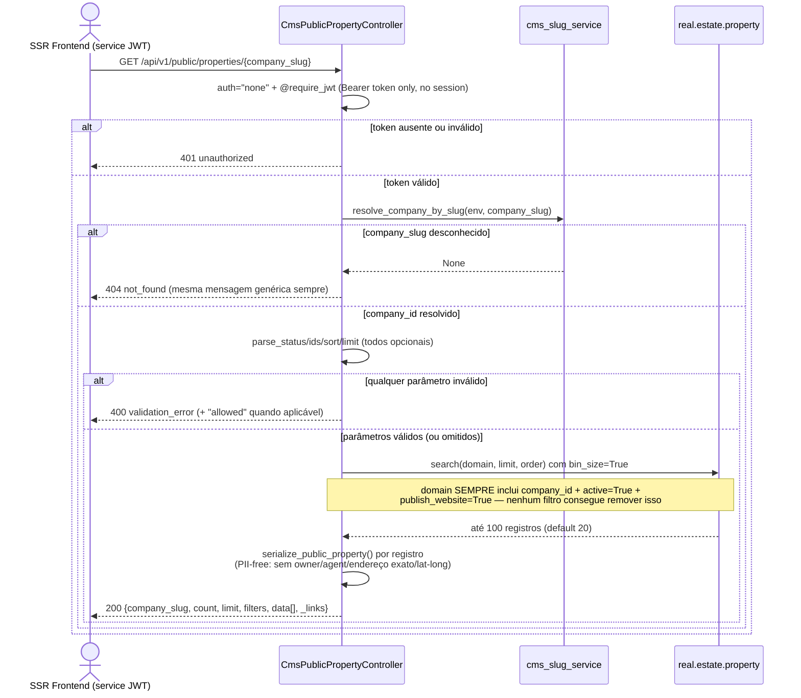
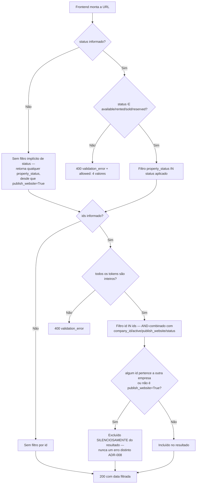

# Feature 029 — Journey Flowcharts

One diagram per user story, covering actor, endpoint calls (method + path), and decision points, per the spec's Success Criteria. Feature 029 is 100% headless API (no Odoo UI/views introduced — see spec NFR5), so all three diagrams are sequence diagrams rather than UI-navigation flowcharts.

---

## User Story 1: SSR frontend renders an agency's public property listing



---

## User Story 2: Public listing filtered by status and explicit ID set



---

## User Story 3: Public main-image delivery for listing cards

```mermaid
sequenceDiagram
    actor U as SSR Frontend (service JWT)
    participant API as CmsPublicPropertyController
    participant Slug as cms_slug_service
    participant Prop as real.estate.property

    U->>API: GET /api/v1/public/properties/{company_slug}/{property_id}/image
    API->>API: auth="none" + @require_jwt (mesmo modelo da US1)
    alt token ausente ou inválido
        API-->>U: 401 unauthorized
    else token válido
        API->>Slug: resolve_company_by_slug(env, company_slug)
        alt company_slug desconhecido
            API-->>U: 404 not_found ("Image not found" — genérico)
        else company_id resolvido
            API->>Prop: search(build_public_property_domain(company_id) + [id=property_id])
            Note over API,Prop: MESMO gate de visibilidade da listagem —<br/>esta rota NUNCA pode ser usada para<br/>enumerar properties não-públicas
            alt não encontrado, outra empresa,<br/>não publicado, arquivado, ou sem imagem
                Prop-->>API: (vazio) ou image=False
                API-->>U: 404 not_found ("Image not found" —<br/>indistinguível entre os 5 casos)
            else encontrado com imagem
                Prop-->>API: property.image (base64)
                API->>API: base64.b64decode + magic.from_buffer (MIME real)
                API-->>U: 200 bytes brutos, Content-Type detectado,<br/>SEM Content-Disposition (renderização inline em )
            end
        end
    end
    Note over U,Prop: Bytes NUNCA são servidos via redirect para<br/>/web/content/ — Response direto (Feature 017 invariant)
